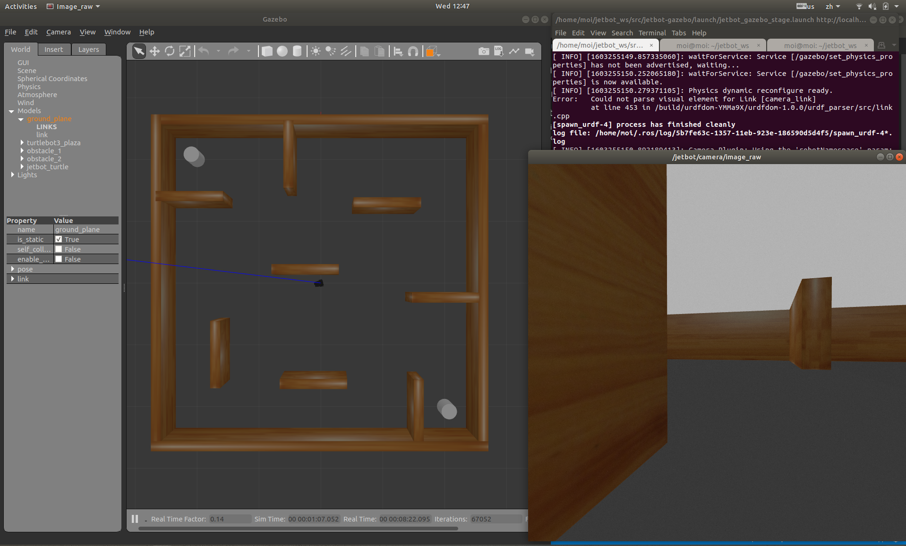

# Gazebo Environments for JetBot

Gazebo environments for testing JetBot navigation and perception algorithms.

This uses the Gazebo models from [https://github.com/dusty-nv/jetbot_ros](https://github.com/dusty-nv/jetbot_ros) but does not require CUDA dependencies in `jetbot_camera`.

## ROS Melodic Installation

Setup your computer to accept software from packages.ros.org.
```bash
    sudo sh -c 'echo "deb http://packages.ros.org/ros/ubuntu $(lsb_release -sc) main" > /etc/apt/sources.list.d/ros-latest.list'
```

Set up your keys
```bash
    sudo apt install curl # if you haven't already installed curl
    curl -s https://raw.githubusercontent.com/ros/rosdistro/master/ros.asc | sudo apt-key add -
```

Make sure your Debian package index is up-to-date:
```bash
    sudo apt update
```

Desktop-Full Install: (Recommended) : ROS, rqt, rviz, robot-generic libraries, 2D/3D simulators and 2D/3D perception
```bash
    sudo apt install ros-melodic-desktop-full
```

## Installation Instructions

This instructions are for Ubuntu 18.04 with ROS Melodic already installed.
Clone this repo into your catkin_ws (the code below creates a new catkin workspace named jetbot_ws in your home folder):

```bash
mkdir -p  ~/jetbot_ws/src && cd ~/jetbot_ws/src
git clone --recursive https://github.com/JWSaye/jetbot-gazebo-sim.git

sudo apt install python-catkin-tools
cd ~/jetbot_ws/  && catkin init && catkin build
```

Install dependencies
```bash
sudo apt install ros-melodic-turtlebot3-gazebo ros-melodic-image-view
```

## Run the simulator

Run the simulator from the terminal with:
```bash
source ~/jetbot_ws/devel/setup.bash
roslaunch jetbot_gazebo jetbot_gazebo_stage.launch
```

Control the Jetbot by keyboard. Open a new terminal window/tab and run:
```bash
sudo apt install ros-melodic-teleop-twist-keyboard
source ~/jetbot_ws/devel/setup.bash
rosrun teleop_twist_keyboard teleop_twist_keyboard.py
```

View camera topic. Open a new terminal window/tab and run:
```bash
source ~/jetbot_ws/devel/setup.bash
rosrun image_view image_view image:=/jetbot/camera/image_raw
```

### Simulation Environments and Image View




## Object Detection with Yolo and Darknet-ROS

TO DO

## Contact

For any questions, write to `jopequ@utu.fi` and `qingqli@utu.fi`.

Visit us at [https://tiers.utu.fi](https://tiers.utu.fi)
